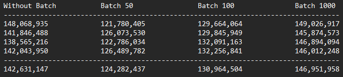

# Nordic RCC Word Counter
## A show case for what it can be
### .NET 9 Console Application

#### Considerations:
+ SOLID
	- Single Responsibility Principle
		1. Separating reading, processing, and output.
		1. DI helps ensure that classes have a single responsibility by delegating object creation and management to a DI container.
		1. Each class is focused on one responsibility.
	- Open/Closed Principle
		1. By depending on abstractions (interfaces) rather than concrete implementations.
		1. We can introduce new implementations without changing the existing code.
	- Liskov Substitution Principle
		1. Using interfaces ensure that derived classes or implementations can be used interchangeably without altering the correctness of the program.
	- Interface Segregation
		1. Defining separate, small interfaces for different responsibilities so that clients won't have to implement the interfaces which they don't use.
	- Dependency Inversion Principle
		1. High-level modules are not depend on low-level modules but on abstractions.
		1. DI promotes this principle by injecting dependencies through interfaces rather than instantiating concrete classes directly.
+ Clean Code
	1. Use descriptive names.
	1. Avoid hardcoding strings, values, ….
	1. Minimize nested loops by moving functionality into classes.
	1. Use LINQ as it improves readability.
	1. Exception handling when dealing with files.
+ Testability
	1. Make use of interfaces to mock file reading and counting.
	1. Use dependency injection.
+ Performance
	1. Use `ConcurrentDictionary`
	1. Use built in options `RemoveEmptyEntries` and `OrdinalIgnoreCase` instead of `Trim` and `ToLowerCase` call.
	1. Use `Parallel` and `AsParallel` to utilize multi thrad parallel processing.
	1. Use `ForEachAsync` to utilize synchronous programming and avoid blocking I/O.
	1. Batching: Instead of processing every word individually and updating the output dictionary frequently [which could cause contention](https://benbowen.blog/post/cmmics_ii/),
	we can group words into batches and process each batch as a single unit.
	The following table show the improvement in process time:
	
	*Finding the optimal batch size is critical.
+ Optimization
	1. Avoid loading entire files into memory at once.
	1. Use `StreamReader` to process line by line instead of `File.OpenText`.
	1. Batching in line proccessing reduces the overhead for long lines.

#### Used packages:
+ `System.Linq.Async` to use `ToListAsync` and `ToAsyncEnumerable` from `QueryableExtensions` class.
+ `FluentAssertion`
+ `NSubstitute` to mock `StreamReader` service

### Further improvements:

+ Improved Exception Handling:

	1. Implement Result Pattern (debatable!) for FileReader Class.
	1. Using Serilog or AWS CloudWatch for better logging mechanisem.

+ Dependency Injection for Separators: We can use **Option Pattern** for more flexible list of separators.

+ Get the list of text files from input or args

+ Parallelization for word counting: it didn't improve the process time in this case but in general it helps with utilizing multi-core processing.

+ Configurable Output Formatting.

+ Sorting Optimization for final result using a **min-heap** or **priority-queue** when top N items is needed.